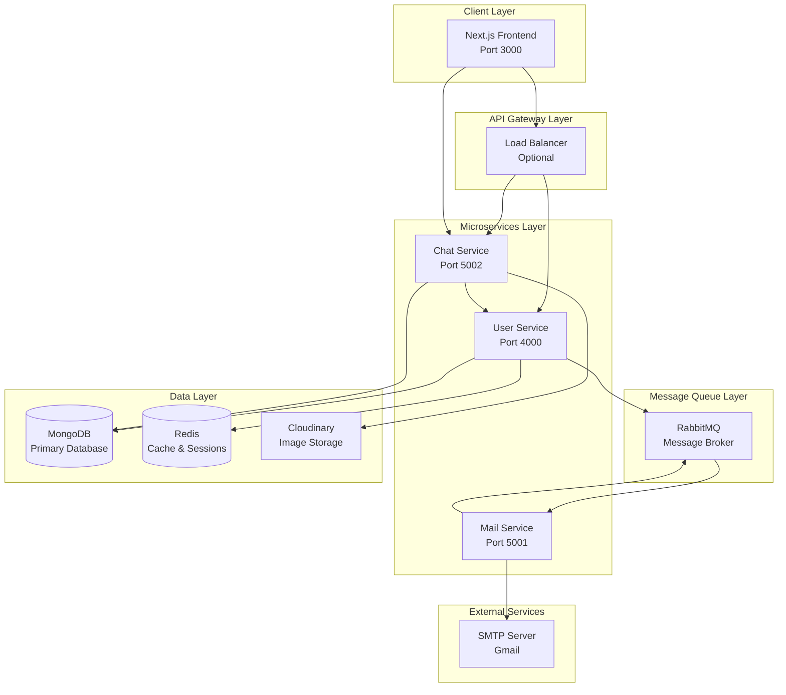

# Technical Architecture Documentation

## System Architecture Overview

The Real-Time Chat Application is built using a **microservices architecture** that separates concerns across multiple independent services. This design ensures scalability, maintainability, and fault tolerance.

## Architecture Diagram



## Service Responsibilities

### 1. User Service (Port 4000)
**Primary Responsibilities:**
- User authentication and authorization
- User profile management
- Session management with Redis
- Email verification workflow
- User data validation and storage

**Key Components:**
- **Controllers**: Handle HTTP requests and responses
- **Models**: Define user data structure and validation
- **Middleware**: Authentication, validation, error handling
- **Config**: Database connections, Redis setup, RabbitMQ integration

**Technology Stack:**
- Express.js for REST API
- MongoDB for user data persistence
- Redis for session management and caching
- RabbitMQ for asynchronous email processing
- JWT for stateless authentication

### 2. Chat Service (Port 5002)
**Primary Responsibilities:**
- Real-time messaging via Socket.io
- Chat room management
- Message persistence and retrieval
- Image upload and processing
- Real-time event broadcasting

**Key Components:**
- **Socket.io Server**: Real-time communication hub
- **Message Controllers**: Handle message CRUD operations
- **Chat Controllers**: Manage chat rooms and participants
- **Cloudinary Integration**: Image storage and optimization
- **Real-time Events**: Typing indicators, online status, message delivery

**Technology Stack:**
- Express.js with Socket.io integration
- MongoDB for message and chat persistence
- Cloudinary for image storage and CDN
- Multer for file upload handling

### 3. Mail Service (Port 5001)
**Primary Responsibilities:**
- Asynchronous email processing
- OTP generation and delivery
- Email template management
- Queue-based message processing

**Key Components:**
- **RabbitMQ Consumer**: Process email queue messages
- **Nodemailer Integration**: SMTP email sending
- **Email Templates**: OTP and notification templates

**Technology Stack:**
- Express.js for service management
- RabbitMQ for message queuing
- Nodemailer for SMTP integration

## Data Flow Architecture

### 1. User Registration Flow
```
Frontend → User Service → MongoDB
    ↓
RabbitMQ → Mail Service → SMTP
    ↓
Frontend ← User Service ← JWT Token
```

### 2. Real-Time Messaging Flow
```
Frontend → Chat Service → MongoDB
    ↓
Socket.io → All Connected Clients
    ↓
Frontend ← Real-time Update
```

### 3. Image Upload Flow
```
Frontend → Chat Service → Cloudinary
    ↓
MongoDB ← Image URL & Metadata
    ↓
Socket.io → Real-time Broadcast
```

## Database Design

### MongoDB Collections

#### Users Collection
```javascript
{
  _id: ObjectId,
  name: String,
  email: String (unique),
  createdAt: Date,
  updatedAt: Date
}
```

#### Chats Collection
```javascript
{
  _id: ObjectId,
  users: [String], // Array of user IDs
  latestMessage: {
    text: String,
    sender: String
  },
  createdAt: Date,
  updatedAt: Date
}
```

#### Messages Collection
```javascript
{
  _id: ObjectId,
  chatId: ObjectId, // Reference to Chats
  sender: String, // User ID
  text: String, // Optional text content
  image: {
    url: String,
    public_id: String
  },
  messageType: String, // "text" or "image"
  seen: Boolean,
  seenAt: Date,
  createdAt: Date,
  updatedAt: Date
}
```

### Redis Data Structure

#### Session Storage
```
Key: session:user_id
Value: {
  token: "jwt_token",
  user: user_object,
  lastActivity: timestamp
}
TTL: 24 hours
```

#### Online Users
```
Key: online_users
Value: Set of user IDs
TTL: 5 minutes (refreshed on activity)
```

## Inter-Service Communication

### 1. Synchronous Communication
- **HTTP REST APIs** for direct service-to-service calls
- **JWT Token Validation** across services
- **User Data Retrieval** from User Service to Chat Service

### 2. Asynchronous Communication
- **RabbitMQ Message Queues** for email processing
- **Event-Driven Architecture** for decoupled operations
- **Queue-based Email Delivery** for better performance

### 3. Real-Time Communication
- **Socket.io WebSockets** for instant messaging
- **Room-based Broadcasting** for targeted message delivery
- **Event-driven Updates** for UI synchronization

## Security Architecture

### 1. Authentication Flow
```
User Login → JWT Generation → Token Storage (Redis)
    ↓
API Requests → Token Validation → Service Access
    ↓
Token Refresh → Extended Session → Continued Access
```

### 2. Authorization Layers
- **JWT Token Validation** on all protected endpoints
- **User Role-based Access** (future enhancement)
- **Rate Limiting** per user and IP
- **CORS Protection** for cross-origin requests

### 3. Data Security
- **Password Hashing** with bcrypt
- **Input Validation** and sanitization
- **File Upload Security** with type validation
- **Environment Variable Protection**

## Scalability Considerations

### 1. Horizontal Scaling
- **Stateless Services** for easy replication
- **Load Balancer** for traffic distribution
- **Database Sharding** for large datasets
- **CDN Integration** for static assets

### 2. Performance Optimization
- **Redis Caching** for frequent data access
- **Connection Pooling** for database efficiency
- **Image Optimization** with Cloudinary
- **Lazy Loading** for frontend components

### 3. Monitoring and Observability
- **Health Check Endpoints** for service monitoring
- **Structured Logging** for debugging and analytics
- **Performance Metrics** collection
- **Error Tracking** and alerting

## Deployment Architecture

### Development Environment
```
Local Machine:
├── Frontend (Next.js) - Port 3000
├── User Service (Node.js) - Port 4000
├── Chat Service (Node.js) - Port 5002
├── Mail Service (Node.js) - Port 5001
├── MongoDB - Port 27017
├── Redis - Port 6379
└── RabbitMQ - Port 5672
```

### Production Environment
```
Cloud Infrastructure:
├── Frontend (Vercel/Netlify)
├── Microservices (Docker Containers)
├── Load Balancer (Nginx/HAProxy)
├── Database Cluster (MongoDB Atlas)
├── Cache Layer (Redis Cloud)
├── Message Queue (RabbitMQ Cloud)
└── CDN (Cloudinary)
```

## Error Handling Strategy

### 1. Service-Level Error Handling
- **Try-Catch Blocks** for async operations
- **Custom Error Classes** for different error types
- **Error Middleware** for centralized error processing
- **Graceful Degradation** for service failures

### 2. Cross-Service Error Management
- **Circuit Breaker Pattern** for service failures
- **Retry Mechanisms** for transient errors
- **Fallback Strategies** for critical operations
- **Error Propagation** with proper context

### 3. Client-Side Error Handling
- **Toast Notifications** for user feedback
- **Error Boundaries** for React components
- **Retry Logic** for failed API calls
- **Offline Support** for network issues

## Testing Strategy

### 1. Unit Testing
- **Service Functions** testing
- **Database Models** validation
- **Utility Functions** testing
- **Mock Dependencies** for isolation

### 2. Integration Testing
- **API Endpoint** testing
- **Database Integration** testing
- **Service Communication** testing
- **Socket.io Events** testing

### 3. End-to-End Testing
- **User Workflows** testing
- **Real-time Features** testing
- **Cross-browser** compatibility
- **Performance** testing

## Monitoring and Logging

### 1. Application Monitoring
- **Service Health** checks
- **Performance Metrics** collection
- **Error Rate** monitoring
- **Response Time** tracking

### 2. Infrastructure Monitoring
- **Database Performance** monitoring
- **Cache Hit Rates** tracking
- **Queue Processing** monitoring
- **Resource Utilization** tracking

### 3. Business Metrics
- **User Activity** tracking
- **Message Volume** monitoring
- **Feature Usage** analytics
- **Error Patterns** analysis

## Future Enhancements

### 1. Scalability Improvements
- **Kubernetes** orchestration
- **Service Mesh** implementation
- **Auto-scaling** based on load
- **Multi-region** deployment

### 2. Feature Additions
- **Video Calling** integration
- **File Sharing** capabilities
- **Message Encryption** end-to-end
- **Push Notifications** mobile support

### 3. Performance Optimizations
- **Database Indexing** optimization
- **Caching Strategies** enhancement
- **CDN Integration** expansion
- **Code Splitting** improvements

This technical architecture provides a solid foundation for a scalable, maintainable, and performant real-time chat application.
